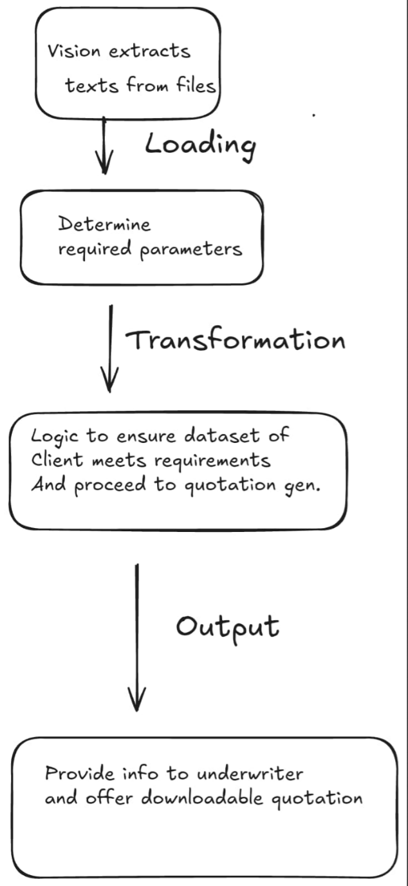

# Automated Underwriter for QuickUnder

QuickUnder is an automated underwriting application designed for Kenya Re, developed as a Python-based tool with a Streamlit frontend. The app simplifies and automates the underwriting process by extracting information from PDF proposal forms, processing that data using OpenAI vision and OCR, and generating quotations or underwriting decisions based on the extracted information.

## Key Features

- **PDF Processing**: Converts proposal form PDFs into images and uses OpenAI vision to extract data.

- **Quotation Generation**: Automatically calculates insurance quotes based on the provided data.

- **Proposal Form Parsing**: Extracts essential information like indemnity, excess required, and additional coverage from submitted proposals.

- **User-Friendly Interface**: Built with Streamlit for a simple and intuitive user experience.

## How It Works

1. The user uploads a PDF proposal form and a financial statement

2. The app processes the PDF and extracts key data using OCR (via `pytesseract`) and OpenAI vision

3. Based on the extracted data, the app calculates a quote or processes the underwriting request.

4. Results are displayed to the user or saved in an output format.

## Installation

1. Clone the repository
```
git clone https://github.com/Kenya-Reinsurance-corporation/bentenzz001-gmail.com.git
cd bentenzz001@gmail.com
pip install -r requirements.txt
streamlit run main.py
```
